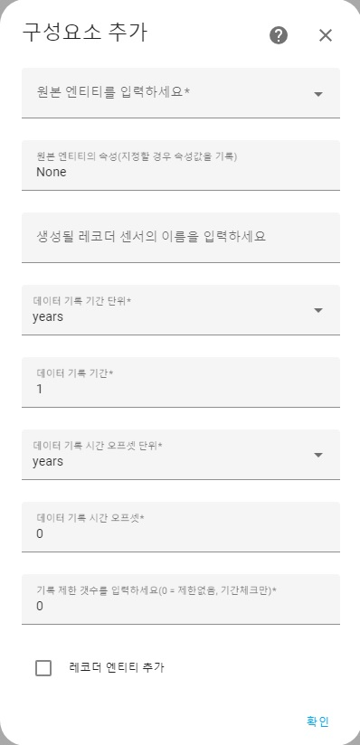

## Custom Recorder  
 
HomeAssistant 에서 엔티티의 변경 기록을 외부 파일에 저장하는 용도로 개발된 커스텀 컴포넌트입니다.
 
 
[설치방법]  

* HASC 에서 저장소 추가로 설치
* 소스코드를 직접 다운로드 받아 HA의 config/custom_component 폴더 하위에 저장소의 custom_component/custom_recorder 폴더를 복사 후 재시작

[설정방법]

* 통합구성요소 추가하기를 이용하여 Custom Recorder 를 추가
* 각 항목에 맞게 설정 후 추가를 완료하면 원본 엔티티의 값이 변경될 때 마다 HomeAssistant 의 config/custom_recorder/data 폴더에 파일을 생성하여 데이터가 기록 됨
 
 

* 원본 엔티티 - 상태 변경을 추적할 원본 엔티티의 id 입력
* 원본 엔티티의 속성 - 지정되어있지 않으면 원본 엔티티의 상태값, 지정되면 원본 엔티티의 속성값을 기록
* 레코더 센서 이름 - 생성될 센서의 이름
* 데이터 기록 기간 단위 - 데이터를 기록할 기간의 단위
* 데이터 기록 기간 - 데이터 기록 기간 
ex) 1 years = 1년간 기록 ( 1년 이전의 기록은 제거 ) 
1 months = 1달간 기록 ( 1달 이전의 기록은 제거 ) 
7 days = 7일간 기록 ( 7일 이전의 기록은 제거 )
  
* 오프셋 단위 - 데이터 기록시 기록 시점의 오프셋 단위
* 오프셋 - 데이터 기록시 기록 시점의 오프셋 
ex) 1 seconds - 실제 상태가 변경된 시점에서 1초 추가하여 기록 
-1 seconds - 실제 상태가 변경된 시점에서 1초 차감하여 기록 
* 기록 제한 갯수 - 기록 기간과는 별개로 기록 가능한 제한 갯수 (0은 무제한) 
